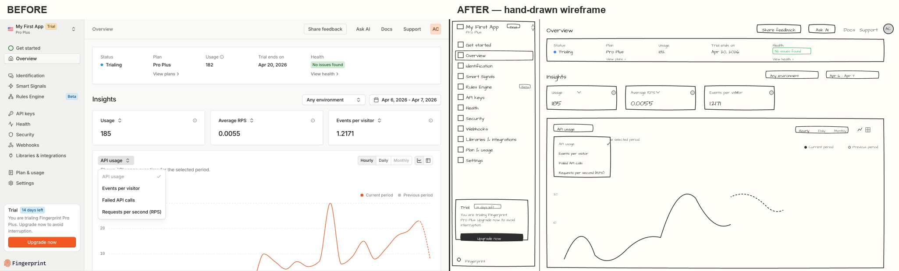

# wireframe — sketchy wireframe generator (Claude Skill)

Turn any polished UI screen into a hand-drawn, napkin-sketch wireframe — wobbly outlines, handwritten typography, warm cream paper. Works straight from a [Paper](https://app.paper.design) design file, a Figma file, or a plain screenshot.



Built out of a real constraint: some of my portfolio case studies are under NDA, so I couldn't show the actual UI. This lets the structure and flow speak for themselves — same layout, no client colors or branding.

## What it does

Feed it a Paper artboard/node or an image, and it produces a new artboard that looks like a designer sketched the same screen by hand:

- Cream paper background (`#FFFEF9`), dark charcoal wobbly strokes
- Handwritten `Architects Daughter` type for all text
- Sketchy icon, button, avatar, and status-badge placeholders
- Semantic status colors preserved (green = complete, blue = in progress, red = attention, gray = not started)

It's a genuinely useful step in a design review or a pitch deck: it strips the polish so people react to structure and flow instead of pixel-level detail.

## Install

```bash
npx skills add TejusRMeda/wireframe-skill
```

Or grab just the skill file directly:

```bash
npx skills add https://github.com/TejusRMeda/wireframe-skill/tree/main/skills/wireframe
```

This drops `SKILL.md` into your agent's skills directory (e.g. `~/.claude/skills/wireframe` for Claude Code).

## Use it

The skill only runs when explicitly invoked (it won't auto-trigger on its description), so ask for it directly:

- "wireframe this screen" (with a Paper selection)
- "wireframe" + an image path or URL
- "make a sketchy version of this"
- "convert to hand-drawn wireframe"

It needs the [Paper MCP server](https://paper.design) or the [Figma MCP server](https://www.figma.com/) connected to read/write those files; screenshots/images work with no extra setup (output still needs one of the two connected to draw into).

## How it works

Generate → verify → fix → confirm, not "build it and hope":

1. **Analyze the source** — reads the Paper/Figma node tree (or the image) and builds an explicit element checklist (every nav item, icon, badge, field, and state — not just the major sections).
2. **Create a matching container** — a new artboard (Paper) or frame (Figma) at the source's *true* dimensions, cream background.
3. **Build incrementally** — writes wobbly card outlines, handwritten text, sketchy icons, status badges, buttons, and avatars as HTML/SVG (Paper) or Plugin API calls (Figma).
4. **Verify against the checklist** — pulls structural data (not just a screenshot) and checks every item from step 1 was actually built, in the right place.
5. **Fix anything missed** — targeted patches for whatever failed verification, then re-checks.
6. **Confirm with you** — reports a pass/fail count and anything intentionally left out (brand colors, logo marks — the whole point of the tool) before calling it done.

Full prompt logic lives in [`skills/wireframe/SKILL.md`](skills/wireframe/SKILL.md).

## Known limitations

- **Figma has more mileage, and its own documented footguns.** Several real bugs turned up and got fixed by running this against live Figma files repeatedly — a nav-hierarchy string that silently lost its indentation, a chart line positioned in the wrong coordinate space (Figma's `vectorPaths` are node-local, not frame-absolute), an unsupported SVG arc command, a container sized from a downscaled preview image instead of the source's true dimensions, a bounds check that only tested one corner instead of all four edges. Each is now documented directly in `SKILL.md` as a guardrail, checked automatically on every run. The Paper path went through the same generate → verify → fix → confirm process on a comparably complex screen (43-element checklist, full nav hierarchy, nested sections) and passed clean on the first attempt — Paper's plain HTML/SVG output has fewer of the coordinate-space and API-surface gotchas Figma's Plugin API has, which is a property of the two platforms, not the skill being less tested on one of them.
- It's a structural sketch, not a pixel-accurate export — spacing and icon shapes are approximated, intentionally.
- Requires the Architects Daughter Google Font to be available in the target file; falls back to a system font and tells you when it isn't.

## License

MIT
